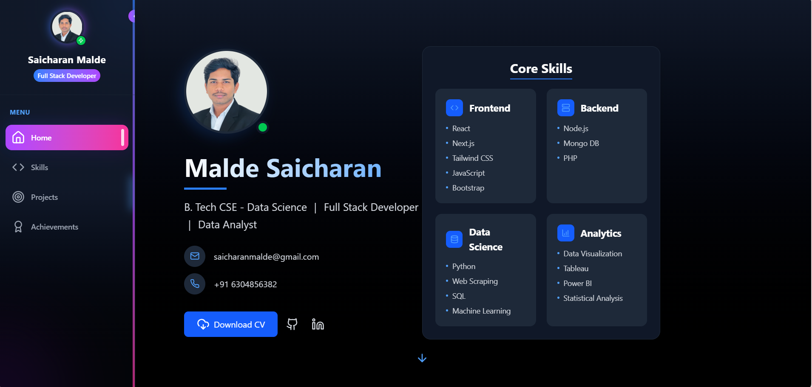

# My Personal Portfolio
Crafted My own portfolio using Vite + React js and Tailwind to showcase my mix of technical expertise



## Overview

This repository contains the source code for my professional portfolio website, accessible at [maldesaicharan.netlify.app](https://maldesaicharan.netlify.app). The website serves as a comprehensive showcase of my professional experience, technical skills, and project portfolio.

## Technologies

The portfolio is built using modern web development technologies:

- **React.js** - A JavaScript library for building dynamic user interfaces
- **Vite** - A next-generation frontend build tool offering exceptional development experience
- **Tailwind CSS** - A utility-first CSS framework for creating custom designs efficiently
- **Netlify** - A platform providing continuous deployment and hosting services

## Installation

To set up this project in your local development environment:

```bash
# Clone the repository
git clone https://github.com/saicharan0623/My-Portfolio.git

# Navigate to the project directory
cd My-Portfolio

# Install required dependencies
npm install

# Start the development server
npm run dev
```

## Development Commands

```bash
# Run development server with hot-reload
npm run dev

# Build for production
npm run build

# Preview production build locally
npm run preview

# Run tests
npm test
```

## Directory Structure

```
My-Portfolio/
├── public/                  # Static assets and favicons
├── src/
│   ├── assets/
│   │   ├── images/          # Image resources
│   │   ├── fonts/           # Custom font files
│   │   └── icons/           # Icon resources
│   ├── components/          # Reusable UI components
│   ├── pages/               # Page-level components
│   ├── styles/              # Global styles and Tailwind utilities
│   ├── utils/               # Utility functions
│   ├── App.jsx              # Main application component
│   └── main.jsx             # Application entry point
├── index.html               # HTML template
├── tailwind.config.js       # Tailwind CSS configuration
├── vite.config.js           # Vite configuration
├── package.json             # Project dependencies and scripts
└── README.md                # Project documentation
```

## Image Assets

All images are stored in the `src/assets/images/` directory. The structure is organized as follows:

- `portfolio-preview.png` - Preview image of the portfolio
- `profile-photo.jpg` - Professional headshot
- `project-thumbnails/` - Thumbnails for project showcases
- `skills/` - Icons representing technical skills
- `backgrounds/` - Background images for different sections

To add or modify images, place them in the appropriate directory and import them in your React components:

```javascript
import profileImage from '../assets/images/profile-photo.jpg';
```

## Deployment

This project is deployed via Netlify's continuous deployment pipeline. The live version is automatically updated whenever changes are pushed to the main branch.

### Deployment Configuration

The deployment is configured with the following parameters:

- **Build Command**: `npm run build`
- **Publish Directory**: `dist`
- **Node Version**: 16.x

### Manual Deployment

For manual deployment:

```bash
# Build the project
npm run build

# Deploy using Netlify CLI
netlify deploy --prod
```

## Customization

To customize this portfolio for your own professional use:

1. Update personal information in the relevant components
2. Replace project details in the `src/data/projects.js` file
3. Adjust the color scheme in `tailwind.config.js` to match your personal brand
4. Replace images in the `src/assets/images/` directory with your own

## Browser Support

The portfolio website is optimized for modern browsers including:

- Chrome (latest)
- Firefox (latest)
- Safari (latest)
- Edge (latest)

## License

This project is licensed under the [MIT License](LICENSE).
